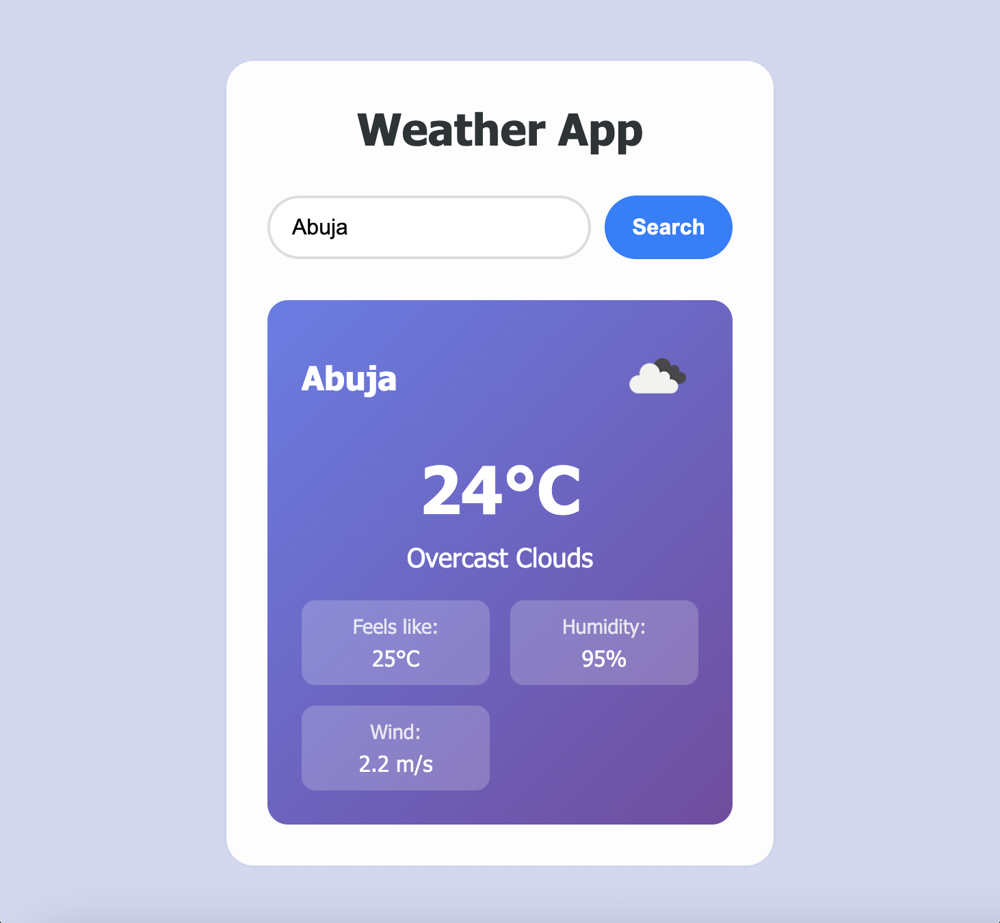
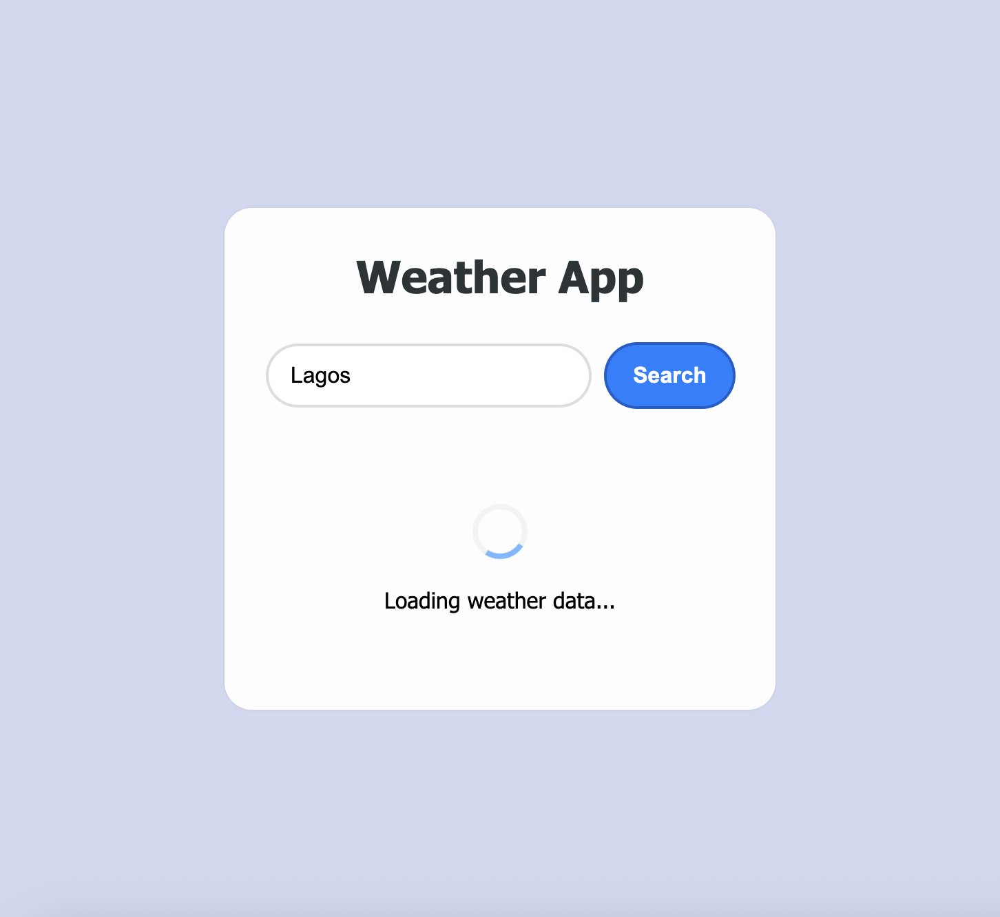

# Weather App

A simple, responsive weather application built with HTML, CSS, and JavaScript that fetches real-time weather data from OpenWeatherMap API with local fallback data.

## Screenshots





## Features

- **City Search**: Search weather by city name
- **Real-time Data**: Fetches current weather from OpenWeatherMap API
- **Local Fallback**: Uses mock data when API is unavailable
- **Responsive Design**: Works on desktop and mobile devices
- **Loading States**: Visual feedback during data fetching
- **Error Handling**: Graceful error messages and retry functionality
- **Local Storage**: Remembers last searched city
- **Weather Icons**: Displays weather condition icons

## Setup

1. **Get API Key**:

   - Sign up at [OpenWeatherMap](https://openweathermap.org/api)
   - Get your free API key

2. **Configure API Key** (Choose one method):

   **Method A - Config File (Recommended):**

   - Open `config.js`
   - Replace `YOUR_API_KEY_HERE` with your actual API key
   - The config file is gitignored to keep keys out of version control

   **Method B - Direct in Script:**

   - Open `script.js`
   - Replace `YOUR_API_KEY_HERE` in the API_KEY constant

3. **Run the App**:
   - Open `index.html` in your web browser
   - Without an API key, it will use demo data for major cities

## Usage

1. Enter a city name in the search box
2. Click "Search" or press Enter
3. View current weather information including:
   - Temperature
   - Weather description
   - "Feels like" temperature
   - Humidity
   - Wind speed

## Fallback Data

If the API is unavailable, the app uses local mock data for these cities:

- London
- New York
- Tokyo
- Paris

## Browser Support

- Modern browsers with ES6+ support
- Chrome, Firefox, Safari, Edge

## File Structure

```
weather-app/
├── index.html      # Main HTML structure
├── style.css       # Responsive styling
├── script.js       # Weather fetching logic
└── README.md       # This file
```

## API Information

This app uses the OpenWeatherMap Current Weather API:

- Endpoint: `https://api.openweathermap.org/data/2.5/weather`
- Units: Metric (Celsius)
- Free tier: 1000 calls/day
